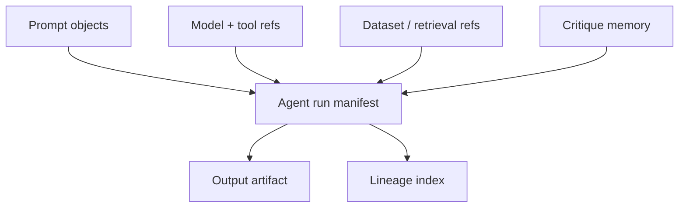

# Architecture

## Proposed ledger-native architecture

## Data graph model

- `prompt -> agent run`: each run references one or more prompt objects
- `model ref -> agent run`: the exact model, checkpoint, or hosted API revision is recorded
- `dataset ref -> agent run`: retrieval sets or training corpora are linked when allowed
- `agent run -> output artifact`: outputs inherit context from the full memory graph
- `output artifact -> future prompt`: outputs can seed later runs, forming creative evolution branches

## System layers

- artifact layer: prompts, output media, critique notes, and manifests
- coordination layer: contracts for attribution, rights, and usage billing
- indexing layer: lineage explorer, semantic search, and branch comparison tools
