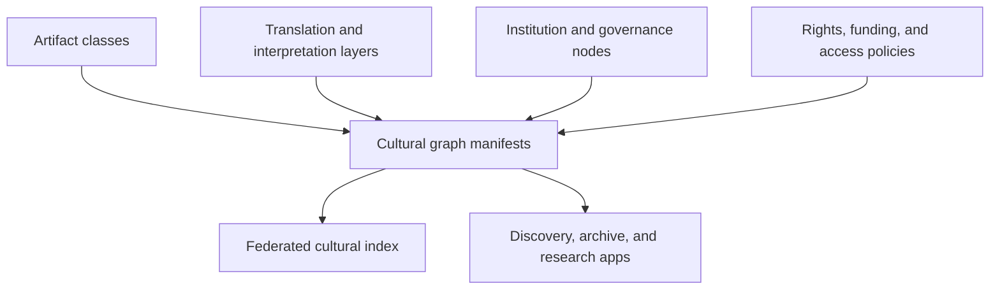

# Architecture

## Proposed ledger-native architecture

## Data graph model

- `artifact -> cultural graph`: media, research, legal, and physical-object nodes share a common reference model
- `translation or interpretation -> source object`: derivative meaning-making remains linked to its source
- `institution -> artifact`: schools, labels, labs, museums, and DAOs become graph participants too
- `policy object -> artifact or collection`: access, rights, funding, and stewardship rules attach to branches
- `collection -> collection`: local archives and community graphs federate into larger cultural maps

## System layers

- artifact layer: durable manifests across many domains
- coordination layer: rights, funding, and stewardship contracts
- indexing layer: federated graph search, ontology mapping, and lineage traversal
