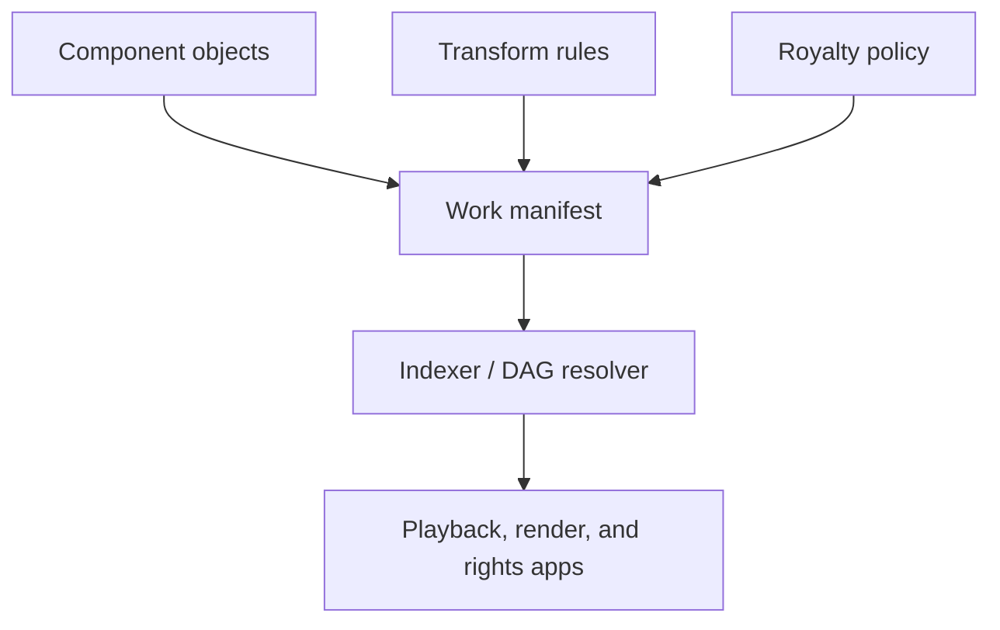

# Architecture

## Proposed ledger-native architecture

## Data graph model

- `component -> work manifest`: a work references samples, layers, clips, or code modules by immutable ID
- `transform rule -> work manifest`: each edge can capture trim, timing, ordering, effects, or parameter changes
- `work manifest -> royalty policy`: payout logic is bound to the composition graph
- `work manifest -> descendant work manifest`: derivatives extend lineage instead of flattening it

## System layers

- artifact layer: chunks, media files, and manifests inscribed or content-addressed
- coordination layer: contracts for attribution, license flags, and split routing
- indexing layer: graph traversal, search, cached reconstruction, and descendant discovery
