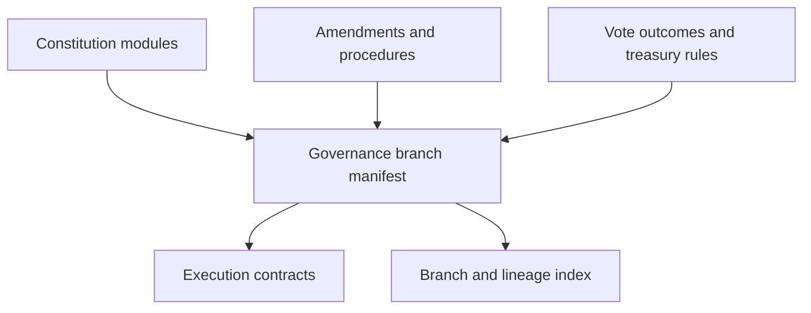

# Architecture

## Proposed ledger-native architecture

## Data graph model

- `constitution module -> governance branch`: base rule modules define proposal, quorum, and delegation behavior
- `amendment -> governance branch`: accepted amendments become edges in the active branch
- `vote outcome -> amendment`: each accepted or rejected proposal remains tied to the rule set that evaluated it
- `governance branch -> forked governance branch`: new communities can branch from a prior constitutional state
- `treasury rule -> execution event`: fund movement references the exact constitutional authority used

## System layers

- artifact layer: constitutional texts, procedure manifests, and governance branch manifests
- coordination layer: Stacks governance and treasury contracts keyed to branch state
- indexing layer: branch diffing, proposal lineage, and constitutional timeline views
