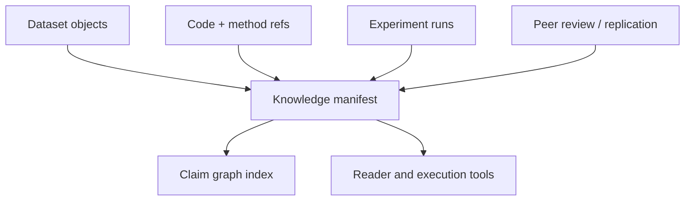

# Architecture

## Proposed ledger-native architecture

## Data graph model

- `dataset -> claim`: claims point to specific dataset versions
- `code ref -> experiment run`: runs reference the exact code and parameter bundle used
- `experiment run -> knowledge manifest`: the paper or report binds together supported claims
- `peer review -> knowledge manifest`: reviews and replications become first-class descendants
- `knowledge manifest -> revised knowledge manifest`: revisions preserve the full trail of changing evidence

## System layers

- artifact layer: datasets, notebooks, code bundles, result manifests, and reviews
- coordination layer: contracts for attribution, staking, citation rewards, or registry state
- indexing layer: claim traversal, reproducibility status, and evidence graph inspection
