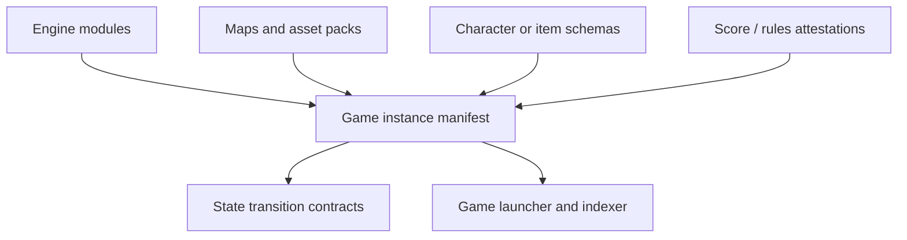

# Architecture

## Proposed ledger-native architecture

## Data graph model

- `engine module -> game instance`: physics, collision, turn rules, or combat loops are referenced by version
- `asset pack -> game instance`: visual and audio resources are reusable across many titles
- `map -> game instance`: levels and world graphs stay separable from runtime logic
- `attestation module -> score record`: high-score or match-verification proofs can be shared across titles
- `game instance -> forked game instance`: descendants inherit engine modules while swapping content

## System layers

- artifact layer: runtime modules, maps, assets, and manifests
- coordination layer: contracts for state transitions, score submission, and ownership
- indexing layer: deterministic reconstruction of game versions and compatibility sets
