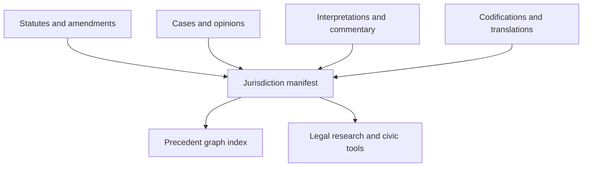

# Architecture

## Proposed ledger-native architecture

## Data graph model

- `statute -> jurisdiction manifest`: statutes and codes define the baseline rule set
- `amendment -> statute`: revisions bind directly to the clauses they alter
- `case -> statute or case`: judicial decisions cite statutes and prior precedent explicitly
- `commentary -> source object`: analysis and summaries remain linked to canonical legal texts
- `jurisdiction manifest -> forked jurisdiction manifest`: local adaptations preserve relationship to parent frameworks

## System layers

- artifact layer: statutes, cases, codifications, and commentary objects
- coordination layer: registries for authority, publication state, and amendment order
- indexing layer: citation graph traversal, temporal views, and clause-level diffing
