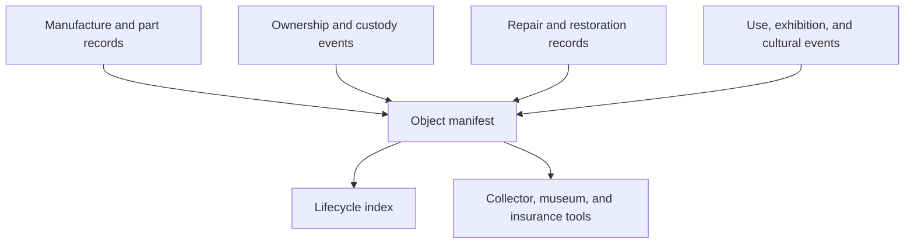

# Architecture

## Proposed ledger-native architecture

## Data graph model

- `part record -> object manifest`: components can be tracked individually and as part of a whole
- `ownership event -> object manifest`: title and custody changes remain distinct
- `repair event -> part or object`: maintenance binds to the exact component affected
- `cultural event -> object`: exhibitions, performances, or historic moments become ledger-linked context
- `object manifest -> derivative object manifest`: major rebuilds or recomposed objects can preserve ancestry

## System layers

- artifact layer: certificates, photos, service logs, and lifecycle manifests
- coordination layer: contracts for title, claims, escrow, or maintenance incentives
- indexing layer: provenance timelines, condition views, and part genealogy
