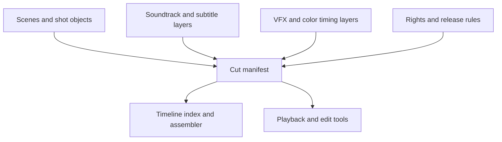

# Architecture

## Proposed ledger-native architecture

## Data graph model

- `scene -> cut manifest`: a cut references scenes and shot ranges by immutable IDs
- `layer object -> scene`: soundtrack cues, subtitles, and effects can attach to timeline segments
- `cut manifest -> release rule`: distribution, rating, or licensing constraints bind to a cut
- `cut manifest -> alternate cut manifest`: new editions inherit the same scenes with different sequencing
- `restoration record -> scene or cut`: preservation work becomes part of the same lineage graph

## System layers

- artifact layer: shots, edits, layers, subtitles, and cut manifests
- coordination layer: contracts for rights, revenue splits, and edition definitions
- indexing layer: timeline assembly, shot reuse detection, and cut comparison tools
