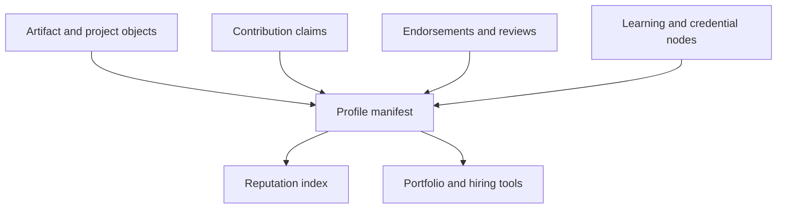

# Architecture

## Proposed ledger-native architecture

## Data graph model

- `artifact -> profile`: a person references the objects they helped produce
- `contribution claim -> artifact`: role, scope, and evidence are attached to specific work
- `endorsement -> contribution claim`: peers or institutions can attest to concrete work, not generic traits
- `learning node -> profile`: certifications and milestones sit beside real project history
- `profile -> collaboration edge -> other profile`: network effects arise from shared artifacts and teams

## System layers

- artifact layer: work outputs, endorsements, milestones, and profile manifests
- coordination layer: contracts for attestations, permissions, and optional reputation markets
- indexing layer: graph search, skill inference, and portfolio assembly
